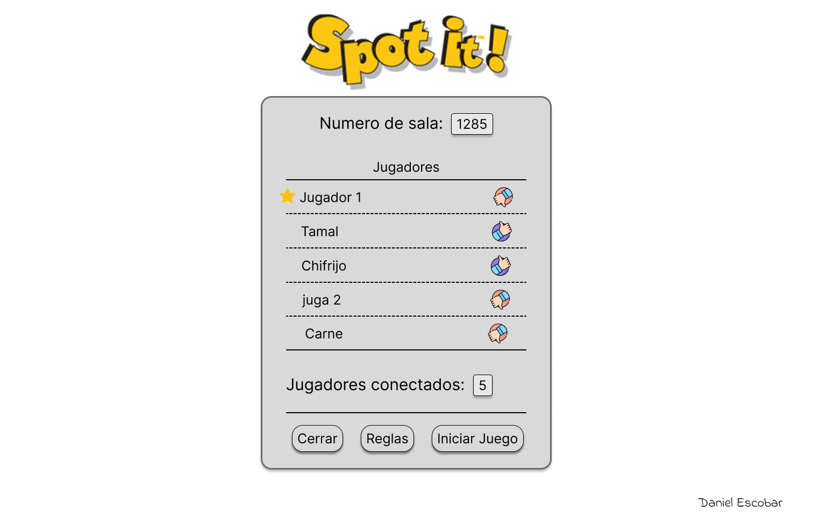

# Diseño

En cuanto a los acuerdos realizados como equipo, se decidió utilizar los sketches de los compañeros Daniel y Fabián, ya que eran los más detallados. El que se utilizó como base fue el de Fabián, luego de realizar una votación entre los integrantes del grupo. No obstante cada integrante realizó un sketch diferete del producto. Aquí los links a tales sketches:

El principal cambio realizado al sketch de Fabián fue en la sala de espera (A) tanto de los invitados como del anfitrión. En el caso del anfitrión, se muestra cuáles jugadores están listos y cuáles no. Algo similar ocurre con la pantalla de espera de los invitados, con la única diferencia que estos pueden presionar un botón para mostrarse como listos o no listos para jugar, esto para dar mayor control a los usuarios y que el sistema se muestre más amigable.

Estos cambios fueron adoptados de las salas de espera realizadas por Daniel (B). Además se decidió agregar el botón de Help que muestra en un popup las reglas del juego para que los jugadores puedan repasar durante la espera.

| Sala de espera A     | Sala de espera B                |
| :---                 | :---                            |
|    |  |
|  |  |

Para la pantalla de juego, se decidió hacer un reacomodo general de los elementos, y se le agregó la sección de Eventos del sketch de Daniel, además se consideró tener que agregar un contador para las cartas que le quedan en la pila/mano del jugador.

| Sala de espera A     | Sala de espera B                |
| :---                 | :---                            |
|  | fabian.orozcochaves@ucr.ac.cr   |

Por último, se le agregó a cada pantalla un logo del juego en la esquina superior izquierda que funciona como botón de Home, para que haya un flujo de salida en cada una de ellas y así el usuario no se sienta atrapado en una sola pantalla. 

<a href="#spot-it-pixies">↑ volver al inicio</a>

